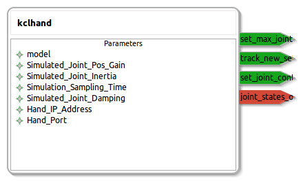

squirrel_kclhand
====================

General description
---------------------
The squirrel_kclhand package

Node: kclhand
---------------------
#### Parameters
**model** *(string, default: SQUIRREL Three Fingered Hand)*
<!--- protected region model on begin -->
<!--- protected region model end -->

**Simulated_Joint_Pos_Gain** *(double, default: 0.1)*
<!--- protected region Simulated_Joint_Pos_Gain on begin -->
<!--- protected region Simulated_Joint_Pos_Gain end -->

**Simulated_Joint_Inertia** *(double, default: 1.0)*
<!--- protected region Simulated_Joint_Inertia on begin -->
<!--- protected region Simulated_Joint_Inertia end -->

**Simulation_Sampling_Time** *(double, default: 0.02)*
<!--- protected region Simulation_Sampling_Time on begin -->
<!--- protected region Simulation_Sampling_Time end -->

**Simulated_Joint_Damping** *(double, default: 5.0)*
<!--- protected region Simulated_Joint_Damping on begin -->
<!--- protected region Simulated_Joint_Damping end -->

**Hand_IP_Address** *(string, default: 127.0.0.1)*
<!--- protected region Hand_IP_Address on begin -->
<!--- protected region Hand_IP_Address end -->

**Hand_Port** *(int, default: 55200)*
<!--- protected region Hand_Port on begin -->
<!--- protected region Hand_Port end -->

#### Published Topics
**joint_states_out** *(squirrel_kclhand_msgs::Joints)*   
<!--- protected region joint_states_out on begin -->
<!--- protected region joint_states_out end -->

#### Subscribed Topics

